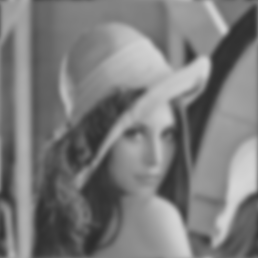
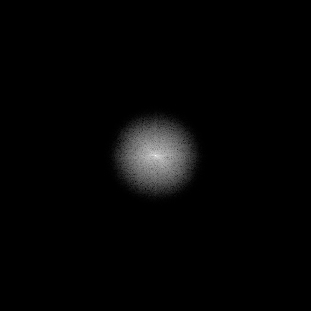
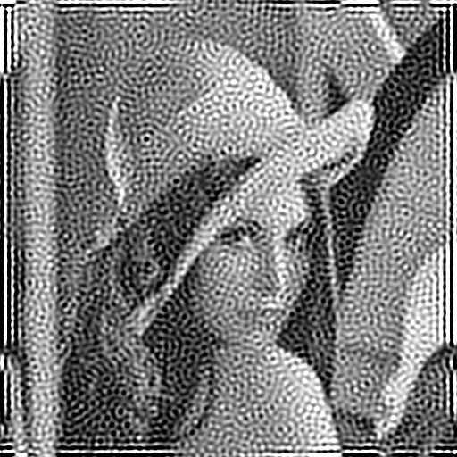

OpenCVFFTBasedGaussianFilter
============================
The code is a OpenCV's sample of filtering with DFT by using cv::dct function.   

Note
====
The code contains two demos; one is FFT based convolution (fftConvolutionTest) and anothor is FFT based deconvolution (fftDeconvolutionTest).  

The first demo can convolute an image by the Gaussian kernel and the circle kernel.  
The seconde demo can deconvolute (i.e. deblur) Gaussian blur with normal or Weiner filter.  

The code is tested on OpenCV2.4.9.  

Relust
======
  
###Input image  
  
###Input image spectrum

  
###Gaussian convoluted image  
  
###Gaussian convoluted spectrum

  
###Gaussian deconvoluted image  

  
###Noisy Gaussian deconvoluted image  (Gaussian noise sigma = 5)
  
###Noisy Gaussian deconvoluted Spectrum  (Gaussian noise sigma = 5)

  
###Noisy Gaussian deconvoluted image  (Gaussian noise sigma = 5)
  
###Noisy Gaussian deconvoluted spectrum  (Gaussian noise sigma = 5)

Todo
====

+ Add more better baundary treatment for deconvolution. Now, We cannot ignore ringing.  
+ Modify generating funcation of Gaussian kernel by directly generation without FFT.

